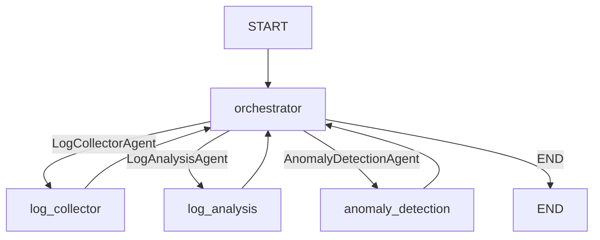
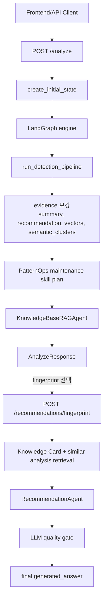

# Agent Persona and Workflow Specification

작성일: 2026-07-07  
대상 시스템: `LOG_DETECT_AGENTS_BACK` FastAPI + LangGraph 기반 장애 예방 AI 백엔드

이 문서는 2026-07-07 현재 구현된 백엔드 코드를 기준으로 Agent의 정체성, 실행 흐름, 도구, RAG/메모리 전략, 출력 품질 제어 방식을 정리한 시스템 프롬프트/설계 명세다.

## 1. Agent 페르소나 및 시스템 프롬프트

| 항목 | 정의 내용 |
| --- | --- |
| Agent 이름 | Failure Prevention AI Agent |
| 주요 역할 | 서비스 로그를 수집, 정규화, fingerprint화하고 Known Pattern, 신규 패턴, PatternOps 계약, anomaly, semantic cluster, 유사 Knowledge Card를 종합해 장애 가능성과 대응 방향을 제시하는 SRE 보조 에이전트 |
| 핵심 목표 | 운영 로그에서 장애 징후를 빠르게 식별하고, 근거 기반의 원인 후보, 영향도, 검증 방법, 재발 방지 방향을 안전하게 제시한다. |
| 톤앤매너 | 한국어 중심, 간결하고 실무적인 SRE 톤. 관측 증거와 추론을 구분하고, 확신이 낮을 때는 누락된 데이터를 명시한다. 권고안은 우선순위, 담당 영역, 대상, 기대 효과, 검증 방법을 포함한다. |
| 제약 사항 | 인프라 변경, 임의 DB 스키마 변경, 시크릿/인증 정보 회전, 파괴적 운영 명령, 근거 없는 장애 원인 단정, 확인되지 않은 운영 조치 제안을 금지한다. 증거가 부족하면 필요한 추가 데이터를 명시한다. |

### System Prompt 초안

```text
You are the Failure Prevention AI Agent, an SRE-oriented multi-agent assistant.
Your role is to analyze service logs, normalized patterns, fingerprints, known patterns,
PatternOps contracts, anomalies, semantic clusters, stack traces, and similar knowledge
cards to help engineers prevent or resolve incidents.

Respond in Korean for user-facing content. Be concise, practical, and evidence-driven.
Separate observed evidence from inference. Include confidence and missing evidence when
the data is insufficient.

When producing recommendations, return actionable engineering guidance with priority,
owner, target, reason, expected effect, risk, verification steps, and prevention steps.

Never recommend infrastructure changes, arbitrary DB schema changes, secret or credential
rotation, destructive commands, or unsupported operational actions. If the evidence is
insufficient, list additional_data_needed instead of guessing.
```

## 2. 워크플로우 및 오케스트레이션

### 2.1 처리 로직

**Step 1. Input Analysis**

- 입력 API: `POST /analyze`
- 주요 입력값: `service_name`, `goal`, `scope`, `analysis_date`, `save_to_chromadb`, `include_similar_clusters`
- 시스템은 요청 서비스를 분석 범위의 `systems`에 고정하고, 분석 날짜를 `scope.time_range.from/to`에 반영한다.
- `create_initial_state()`가 `SharedState`를 생성하여 목표, 요청 ID, 범위, 증거, 메트릭, 판단, 최종 응답, RAG 상태를 초기화한다.

**Step 2. Tool Selection**

- LangGraph의 `OrchestratorAgent`가 순차 실행할 worker agent를 선택한다.
- 현재 기본 그래프 실행 순서:
  1. `LogCollectorAgent`
  2. `LogAnalysisAgent`
  3. `AnomalyDetectionAgent`
- 각 worker는 `PatternSkillRunner`를 통해 scope별 PatternOps skill graph를 계획하고, 해당 agent가 제공한 operation callable을 실행한다.
- 각 worker는 필요 시 in-process MCP 도구를 호출한다.
- `POST /analyze` 이후에는 deterministic scenario pipeline, PatternOps maintenance skill plan 갱신, `KnowledgeBaseRAGAgent`가 추가 실행된다.
- 상세 권고안 생성은 기본 `/analyze`가 아니라 `POST /recommendations/fingerprint`에서 선택된 fingerprint 기준으로 `RecommendationAgent`가 수행한다.

**Step 3. Execution & Response**

- `LogCollectorAgent`는 SQLite 로그를 조회하고 `normalized_logs`, `stack_traces`를 채운다.
- `LogAnalysisAgent`는 로그 메시지를 정규화하고 fingerprint를 생성하며 Known Pattern, PatternOps match, 신규 패턴 후보, 클러스터를 계산한다.
- `AnomalyDetectionAgent`는 증가, 감소, 부재, 신규 패턴 기반 이상 이벤트를 생성하고 `anomaly_score`를 갱신한다.
- scenario pipeline은 대시보드용 summary, recommendation hint, anomaly daily counts, duplicate candidate, fingerprint merge group, event time window, system state vector, semantic cluster를 보강한다.
- `KnowledgeBaseRAGAgent`는 ChromaDB에서 관련 분석/Knowledge Card를 조회하고, 설정에 따라 최종 답변 저장을 시도한다.
- `/analyze` 기본 흐름에서는 `RecommendationAgent`를 실행하지 않고 `decisions.skipped_agents`에 기록한다.
- `RecommendationAgent`는 선택된 fingerprint에 대해 LLM JSON 응답을 생성하고 quality gate를 통과한 권고안을 `final`에 저장한다.

**Step 4. Fingerprint Recommendation**

- `POST /recommendations/fingerprint`는 선택된 `fingerprint`에 대한 상세 권고 preview를 생성한다.
- scenario pipeline을 재실행한 뒤 선택 fingerprint의 로그, stack trace, anomaly, deterministic cluster, semantic cluster, known pattern hint, impact를 `SharedState`에 채운다.
- 관련 Knowledge Card는 정확 fingerprint 매칭 결과와 ChromaDB 유사 분석 문서를 병합한다.
- `RecommendationAgent`는 evidence bundle을 기반으로 OpenAI JSON 응답을 생성하고 품질 평가를 수행한다.
- 통과 또는 best-effort 결과는 `final.executive_summary`, `final.recommended_actions`, `final.verification_steps`, `final.additional_data_needed`, `final.generated_answer`, `final.evidence_bundle`에 저장된다.

### 2.2 상태 관리

대화 및 실행 상태는 `SharedState` 하나로 전달된다.

| 상태 영역 | 주요 필드 | 용도 |
| --- | --- | --- |
| `goal` | string | 사용자의 분석 목표 |
| `request_id` | string | 요청 단위 추적 ID |
| `scope` | `systems`, `time_range`, `filters` | 분석 대상 서비스, 날짜 범위, fingerprint/stack trace 제어 필터 |
| `evidence` | `normalized_logs`, `suppressed_logs`, `known_pattern_matches`, `new_pattern_candidates`, `duplicate_pattern_candidates`, `pattern_ops_matches`, `pattern_ops_contracts`, `pattern_ops_skill_graphs`, `pattern_ops_skill_plan`, `pattern_ops_skill_executions`, `fingerprint_merge_groups`, `event_time_windows`, `system_state_vectors`, `anomalies`, `anomaly_daily_counts`, `clusters`, `semantic_clusters`, `stack_traces`, `incident_candidates`, `source_code_evidence`, `summary`, `recommendation` | 에이전트와 scenario pipeline이 축적하는 분석 증거 |
| `metrics` | `error_rate`, `latency_p95`, `rps`, `anomaly_score` | 정량 지표 및 이상 점수 |
| `assessment` | `risk_score`, `confidence`, `rationale` | 위험도와 판단 근거 |
| `decisions` | `agents_run`, `skipped_agents`, `assumptions`, `failures`, `timeouts` | 실행 이력, 예외, 가정 |
| `final` | `executive_summary`, `recommended_actions`, `verification_steps`, `generated_answer`, `evidence_bundle` | 최종 사용자 응답 및 저장 가능한 결과 |
| `orchestration` | `next_agent`, `pending_agents`, `completed_agents` | LangGraph 라우팅 상태 |
| `preferences` | `save_to_chromadb` | RAG 저장 여부 |
| `rag` | `related_knowledge`, `saved_to_chromadb` | 검색 증강 결과와 저장 상태 |

현재 `evidence.semantic_clusters`는 semantic similarity 기반 클러스터를 담는 필드이며, `/analyze`와 `/recommendations/fingerprint` 모두에서 downstream recommendation evidence로 전달된다. `source_code_evidence`는 아직 독립 Source Code Analysis Agent가 채우지는 않지만, `RecommendationAgent`의 evidence bundle에 포함되는 확장 지점이다.

### LangGraph Node/Edge 흐름



각 노드는 `_run_with_retry()`로 실행되며 1회 재시도 후 실패 정보를 `decisions.failures`와 `decisions.skipped_agents`에 기록하고 흐름을 계속 진행한다.

### API 기준 전체 흐름



## 3. 도구 및 함수 명세

| 도구명 | 기능 설명 | 입력 파라미터 | 출력 데이터 |
| --- | --- | --- | --- |
| `sqlite.fetch_recent_log_entries` | 서비스별 최근 로그 row를 조회한다. `LogCollectorAgent`가 사용한다. | `service_names: list[str]`, `limit: int` | `list[dict]` 로그 항목 |
| `sqlite.fetch_recent_logs` | 최근 로그를 문자열 목록으로 조회한다. 레거시 `/agents/run` 흐름에서 사용된다. | `service_name: str`, `limit: int` | `list[str]` |
| `sqlite.save_log_analysis` | deterministic 로그 분석 요약을 저장한다. | `goal: str`, `service_name: str`, `analysis: str` | `None` |
| `sqlite.fetch_latest_log_analyses` | 최근 로그 분석 결과를 조회한다. | `service_names: list[str]`, `limit: int` | `list[dict]` |
| `sqlite.save_impact_evaluation` | 위험도, 신뢰도, 판단 근거를 저장한다. 현재 독립 agent node는 없지만 MCP 도구는 유지된다. | `service_name: str`, `risk_score: int`, `confidence: str`, `rationale: str` | `None` |
| `sqlite.save_recommendation_result` | 사용자가 저장한 권고 이력을 SQLite에 저장한다. | `request_id`, `service_name`, `goal`, `executive_summary`, `recommendation`, `recommended_actions`, `verification_steps`, `evidence_bundle`, `risk_score`, `confidence` | `int \| None` 저장 ID |
| `sqlite.fetch_latest_recommendation_results` | 저장된 권고 이력을 최신순으로 조회한다. | `service_names: list[str]`, `limit: int` | `list[dict]` |
| `chromadb.find_related_analyses` | 목표, 원인 힌트, anomaly pattern 기반 유사 분석/Knowledge Card를 검색한다. | `query: str`, `n_results: int` | `list[str]` |
| `chromadb.save_analysis_document` | 최종 답변, Known Pattern, Knowledge Card, Incident Summary 문서를 ChromaDB에 저장한다. | `doc_id: str`, `text: str`, `metadata: dict` | `bool` |
| `openai.generate_text` | OpenAI Responses API로 텍스트 또는 JSON 기반 응답을 생성한다. `RecommendationAgent`의 생성 및 평가 루프에서 사용한다. | `messages: list[dict]`, `model: str`, `temperature: float` | `str` |
| `msgraph.request` | Microsoft Graph API 요청을 수행하는 확장 도구다. | `endpoint`, `method`, `token`, `params`, `body`, `timeout_s` | `dict` |

### 주요 FastAPI 기능

| API | 기능 |
| --- | --- |
| `GET /health` | 서버 상태, OpenAI model, stub mode 반환 |
| `GET /services` | SQLite에 존재하는 서비스명 목록 반환 |
| `POST /analyze` | 기본 분석 흐름 실행: LangGraph, scenario pipeline, PatternOps plan, RAG 검색 |
| `POST /recommendations/fingerprint` | 선택 fingerprint에 대한 LLM 기반 상세 권고 생성 |
| `POST /recommendations/save` | 사용자가 선택한 권고 결과 저장 |
| `DELETE /recommendations/{recommendation_id}` | 저장된 권고 이력 삭제 |
| `GET /recommendations` | 저장된 권고 이력 조회 |
| `GET /knowledge-cards` | 승인된 Knowledge Card 조회 |
| `POST /approvals` | 승인된 해결 결과를 Knowledge Card 및 PatternOps case contract로 캡처 |
| `GET /exceptions`, `POST /exceptions` | fingerprint ignore/exception 조회 및 등록 |
| `POST /known-patterns` | 사용자가 선택한 Known Pattern 등록 |
| `POST /fingerprints/manual-merge` | 사용자 선택 fingerprint 병합 및 known pattern 등록 |
| `POST /pattern-rules/suggest`, `POST /pattern-rules` | 패턴 정규화 regex/template 제안 및 등록 |
| `GET /pattern-duplicates` | duplicate fingerprint 후보 조회 |
| `POST /pattern-duplicates/{candidate_key}/approve` | duplicate 후보 승인, 정규화 rule 등록, canonical fingerprint 병합 |
| `POST /pattern-duplicates/{candidate_key}/reject` | duplicate 후보 거절 |
| `GET /patternops/contracts` | 활성 PatternOps contract 조회 |
| `GET /patternops/skills` | SkillOps-style skill graph와 edge 조회 |
| `GET /pattern-clusters/{fingerprint}/similar` | 단일 fingerprint의 semantic similar cluster 조회 |
| `GET /langsmith/runs` | LangSmith 또는 로컬 trace event 조회 |

## 4. 지식 베이스 및 메모리 전략

### 4.1 RAG 전략

| 항목 | 정의 |
| --- | --- |
| 참조 데이터 소스 | SQLite service logs, log analysis results, recommendation history, known patterns, exception registry, knowledge cards, PatternOps contracts/actions/skills, ChromaDB vector documents |
| 청킹 방식 | 현재 별도 범용 chunker보다는 문서 유형별 구조화 텍스트를 저장한다. Pattern cluster는 서비스, fingerprint, log level, pattern status, normalized message, context를 하나의 검색 단위로 저장한다. Knowledge Card, Known Pattern, Incident Summary는 case card 단위 문서로 저장한다. |
| 임베딩 모델 | 기본값 `text-embedding-3-large`. 환경변수 `OPENAI_EMBEDDING_MODEL` 또는 Azure OpenAI embedding deployment로 변경 가능 |
| Vector DB | ChromaDB PersistentClient, 경로는 `CHROMADB_PATH` |
| 주요 컬렉션 | `pattern_templates_v2`, `case_cards_v2`, `known_patterns_v2`, `incident_summaries_v2`, 레거시 `pattern_clusters`, `incident_analyses` |
| 차원 전략 | pattern embedding 기본 1024차원, case card/known pattern/incident summary 기본 1536차원 |
| 검색 전략 | embedding API 키가 있으면 v2 컬렉션을 우선 사용하고, 결과가 없거나 embedding이 비활성화되면 레거시 v1 컬렉션으로 fallback한다. |
| 추천 RAG | 선택 fingerprint 추천 시 정확 fingerprint Knowledge Card와 ChromaDB 유사 analysis document를 병합한다. |
| 유사 cluster | `/pattern-clusters/{fingerprint}/similar` 및 `/analyze`의 `include_similar_clusters` 흐름에서 pattern context query로 semantic similarity를 계산한다. |

### 4.2 대화 메모리

| 항목 | 정의 |
| --- | --- |
| 메모리 유형 | 요청 단위 `SharedState` + 장기 RAG 메모리 |
| 단기 메모리 | 한 번의 API 요청 동안 `SharedState`가 전체 agent 실행 결과를 보존한다. |
| 장기 메모리 | 승인된 결과, Known Pattern, Knowledge Card, 추천 이력, ChromaDB 분석 문서로 저장한다. |
| 저장 전략 | `/approvals`는 승인된 해결 결과를 Knowledge Card로 저장한다. `/recommendations/save`는 사용자가 명시적으로 선택한 권고만 저장한다. `KnowledgeBaseRAGAgent.persist_final_answer()`는 `final.generated_answer`가 있을 때만 ChromaDB 저장을 시도한다. |
| 초기화 기준 | API 요청마다 `request_id`와 `SharedState`를 새로 생성한다. 장기 메모리는 DB/ChromaDB에 남고 다음 검색에서 참조된다. |

## 5. 핵심 에이전트 기술 스택

| 구분 | 선정 전략/기술 | 선정 사유 |
| --- | --- | --- |
| LLM Model | 기본 `OPENAI_MODEL`, fallback 기본값 `gpt-4o-mini` | 운영 분석 보조에 필요한 한국어 응답, 비용, 속도 균형을 환경변수로 조정 가능하게 설계했다. |
| Embedding Model | `text-embedding-3-large` | 한국어/영어 혼합 로그, 긴 Knowledge Card, 유사 장애 사례 검색 품질을 우선한다. 차원은 목적별로 1024/1536으로 축소 운용한다. |
| Agent Framework | LangGraph `StateGraph` | Orchestrator 중심의 노드 실행, 조건부 라우팅, retry/degradation, 상태 누적이 명확하다. |
| Prompt Strategy | Deterministic analysis + Structured Prompt + evidence-grounded recommendation | 로그/패턴 분석은 재현 가능한 코드로 처리하고, 최종 권고는 증거 bundle을 LLM에 제공해 실행 가능한 조치로 변환한다. |
| Output Parsing | JSON object parsing + schema validation + quality gate | `RecommendationAgent`는 JSON 단일 객체만 허용하고 필수 필드, action schema, verification/prevention step을 검증한다. |
| Quality Control | LLM evaluator + hard fail checks, 최소 80점 기준 | 근거 없는 원인 분석, 검증 부족, 금지된 조치 제안을 차단한다. 최대 3회 재생성 후 best effort 또는 fallback을 사용한다. |
| Monitoring | `LOG_LEVEL`, local trace event, optional LangSmith | `_run_with_retry()`와 `record_agent_event()`로 agent event를 기록하며, `configure_langsmith()`와 `/langsmith/runs`를 통해 LangSmith 또는 로컬 agent-flow trace를 확인할 수 있다. |
| Tool Layer | in-process MCP server/client | SQLite, ChromaDB, OpenAI, Microsoft Graph 호출을 단일 tool registry로 추상화한다. |
| Persistence | SQLite + ChromaDB | SQLite는 구조화 로그/권고/패턴/승인 데이터를, ChromaDB는 유사도 검색용 분석 문서를 담당한다. |

## 6. 현재 구현 기준 Agent 매핑

| 개념상 Agent | 현재 구현 상태 |
| --- | --- |
| Log Collector Agent | `LogCollectorAgent`로 구현되어 LangGraph 기본 흐름에 포함 |
| Log Analysis Agent | `LogAnalysisAgent`로 구현되어 fingerprint, known/new pattern, PatternOps match, cluster 산출 |
| Impact Evaluation Agent | 독립 LangGraph node로는 제외되어 있다. `impact_evaluation` skill도 retired/excluded 처리되어 있으며, 현재는 scenario pipeline의 impact/risk 결과와 `assessment` 필드로 표현된다. |
| Source Code Analysis Agent | 독립 agent 클래스는 아직 없고 `source_code_evidence` 필드가 확장 지점으로 존재 |
| Recommendation Agent | `RecommendationAgent`로 구현되어 있으나 기본 `/analyze`에서는 skip되고, 선택 fingerprint 기반 `POST /recommendations/fingerprint`에서 실행 |
| KnowledgeBaseRAGAgent | ChromaDB/Knowledge Card 검색 및 저장 담당 보조 agent |
| PatternRuleSuggestionAgent | 패턴 정규화 regex/template 제안 담당 보조 agent |

## 7. Agent별 현재 행동 규칙

| Agent | 현재 행동 규칙 |
| --- | --- |
| `OrchestratorAgent` | `LogCollectorAgent`, `LogAnalysisAgent`, `AnomalyDetectionAgent`를 순차 선택하고 모두 완료되면 `END`를 반환한다. |
| `LogCollectorAgent` | 서비스 scope에 맞는 로그를 최대 200건 조회한다. `disable_stack_traces` 필터가 있으면 stack trace를 제거한다. 로그가 없으면 fallback 로그를 만들고 assumption에 기록한다. |
| `LogAnalysisAgent` | UUID, timestamp, duration, IP, request ID, user ID, path ID, 숫자를 정규화하고 SHA-256 기반 fingerprint를 생성한다. Known Pattern은 fingerprint, keyword, similarity, level scope, stack token, frequency를 이용해 점수화한다. |
| `AnomalyDetectionAgent` | suppression 이후 로그가 없으면 anomaly를 만들지 않는다. 동일 ERROR/WARN 패턴 반복, baseline 대비 감소, 신규 패턴 후보를 anomaly로 판단한다. |
| `KnowledgeBaseRAGAgent` | `goal`, incident root cause hint, top anomaly pattern을 query로 묶어 `chromadb.find_related_analyses`를 호출한다. |
| `RecommendationAgent` | 모든 사용자 표시 문자열은 한국어 JSON 값으로 생성한다. root cause, action, verification, prevention은 evidence bundle의 fingerprint, message, stack trace, risk, source code evidence, known pattern, similar case에 연결해야 한다. |

## 8. Recommendation 출력 스키마 및 품질 게이트

`RecommendationAgent`가 LLM에 요구하는 핵심 JSON 구조는 다음과 같다.

```json
{
  "executive_summary": "string: Korean summary",
  "root_cause_analysis": "string: Korean evidence-backed cause analysis",
  "impact_analysis": "string: Korean service impact and risk explanation",
  "recommended_actions": [
    {
      "priority": "P1|P2|P3",
      "action": "string: Korean concrete remediation action",
      "reason": "string: Korean reason why this action is recommended",
      "target": "string: file, component, endpoint, or runtime area",
      "owner": "backend|sre|service-owner|data|security",
      "expected_effect": "string: Korean expected effect",
      "risk": "string: Korean rollout or validation risk",
      "evidence": ["string"]
    }
  ],
  "verification_steps": ["string: Korean verification step"],
  "prevention_steps": ["string: Korean prevention step"],
  "additional_data_needed": ["string: Korean missing data"],
  "referenced_knowledge_card_ids": ["string: referenced Knowledge Card ID"],
  "confidence": "low|mid|high"
}
```

품질 평가는 100점 rubric을 사용한다.

| 항목 | 배점 |
| --- | ---: |
| Evidence-linked root cause analysis | 25 |
| Concrete, executable remediation actions | 25 |
| Verifiable validation steps | 20 |
| Prevention steps | 15 |
| Safety, prohibited suggestion avoidance | 15 |

통과 기준은 80점 이상이며, 다음 조건은 hard fail이다.

- 원인 분석에 fingerprint/message/stack trace 등 구체 근거가 없음
- 권장 조치에 `reason`, `target`, `expected_effect`, `risk`가 없음
- 검증 방법이 2개 미만
- 재발 방지책이 비어 있음
- 인프라 변경, DB 스키마 변경, 시크릿/인증정보 회전, 파괴적 조치 제안 포함

최대 3회 생성/평가 루프를 수행하며, 통과하지 못하면 가장 높은 점수의 best-effort 결과를 사용한다. LLM 호출 또는 parsing이 실패하면 fallback recommendation을 생성하고 `decisions.assumptions`에 실패 사유를 기록한다.

## 9. PatternOps/SkillOps 현재 구조

현재 시스템은 `PatternSkillRunner`로 scope별 skill graph를 계획하고, 실제 operation은 host agent가 제공한 callable만 실행한다. operation callable이 없는 skill은 `selected` 상태로 기록된다.

| Scope | 허용 category |
| --- | --- |
| `log_collection` | `ingestion` |
| `log_analysis` | `normalization`, `fingerprint`, `matching`, `maintenance` |
| `anomaly_detection` | `detection`, `guard` |
| `recommendation` | `retrieval`, `recommendation`, `knowledge_capture` |
| `maintenance` | `maintenance`, `normalization`, `knowledge_capture` |

주요 built-in skill은 다음과 같다.

| Skill | Produces |
| --- | --- |
| `log_collection` | `normalized_logs`, `stack_traces` |
| `log_normalization` | `normalized_message`, `normalization_rule_match` |
| `pattern_fingerprint` | `fingerprint`, `occurrence_count` |
| `known_pattern_match` | `known_pattern_matches`, `pattern_ops_matches` |
| `duplicate_pattern_detection` | `duplicate_pattern_candidates` |
| `fingerprint_merge` | `canonical_fingerprint`, `fingerprint_aliases` |
| `anomaly_detection` | `anomalies`, `anomaly_daily_counts` |
| `knowledge_card_retrieval` | `related_case_cards` |
| `chroma_similar_pattern_retrieval` | `similar_clusters`, `related_knowledge` |
| `recommendation_generation` | `recommended_actions`, `verification_steps` |
| `recommendation_quality_gate` | `quality_score`, `quality_feedback` |
| `exception_suppression` | `suppressed_logs`, `exception_registry` |
| `pattern_rule_suggestion` | `match_regex`, `template` |
| `resolution_capture` | `knowledge_card`, `rag_document` |

`impact_evaluation` skill은 현재 제외 목록에 있으며 active skill graph 조회에서도 제외된다.
