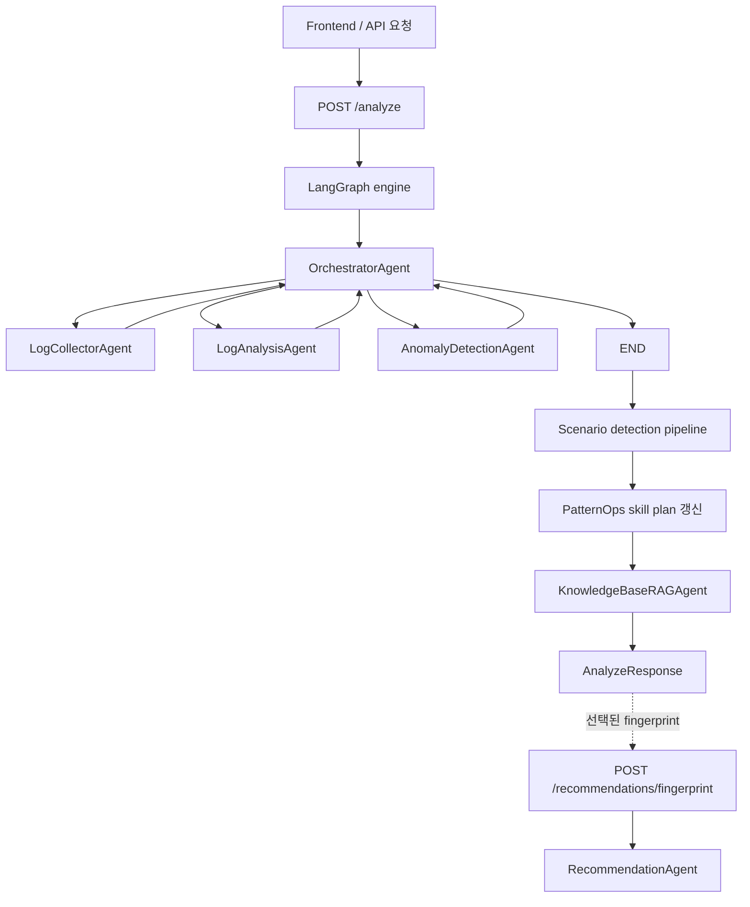
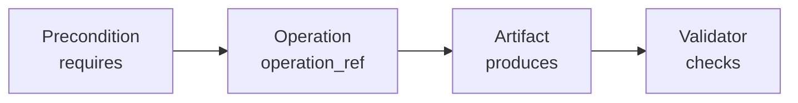
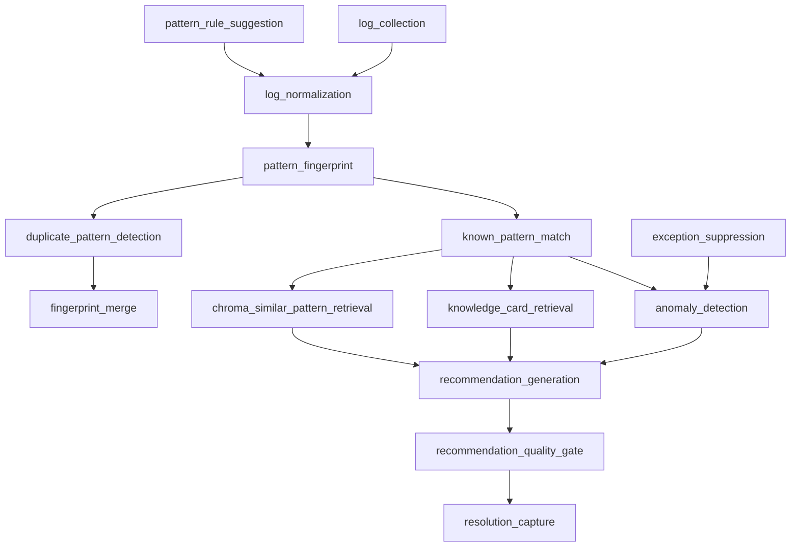
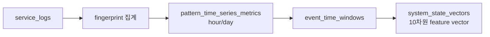
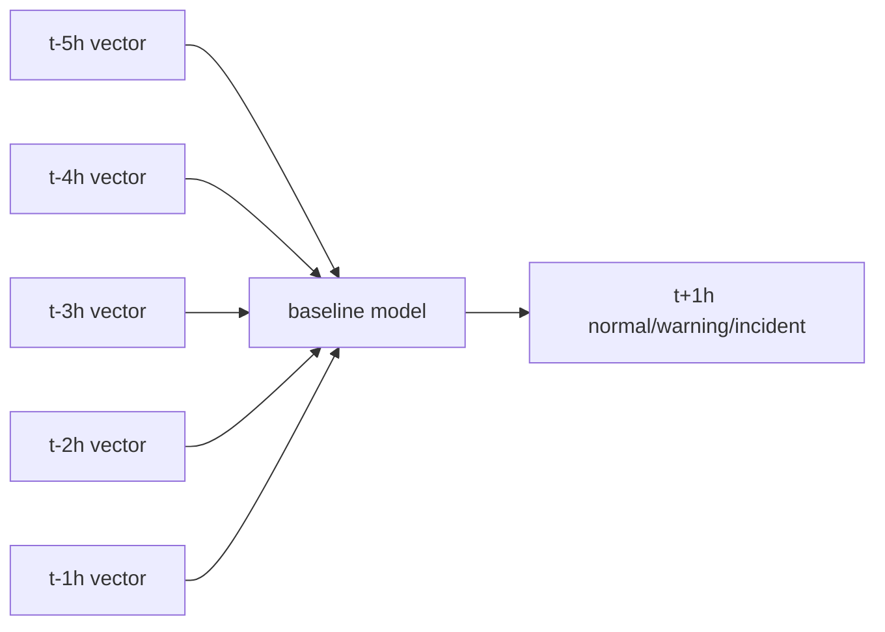

# AIOps / PatternOps 논의 요약

작성일: 2026-07-03

이 문서는 FastAPI + LangGraph 기반 로그 탐지 백엔드, PatternOps/SkillOps-style
Registry, embedding/유사도, time-window 상태 벡터, trajectory modeling 가능성에
대해 지금까지 논의한 내용을 정리한 기록입니다.

## 현재 아키텍처

이 프로젝트는 LangGraph 기반 멀티 에이전트 로그 분석 시스템을 위한
Python/FastAPI 백엔드입니다. 프론트엔드는 별도 프로젝트로 구성되어 있습니다.

현재 주요 런타임 구성 요소는 다음과 같습니다.

| 실제 구성 요소 | 현재 역할 |
| --- | --- |
| `OrchestratorAgent` | LangGraph에서 다음에 실행할 worker agent를 결정 |
| `LogCollectorAgent` | 로그를 수집하고 `normalized_logs` 생성 |
| `LogAnalysisAgent` | 정규화, fingerprint 생성, Known/New 판정, PatternOps match 수행 |
| `AnomalyDetectionAgent` | 패턴 증가/감소/부재/신규 발생 기반 anomaly 탐지 |
| `KnowledgeBaseRAGAgent` | 관련 지식 조회 및 필요 시 저장 |
| `RecommendationAgent` | LLM + RAG 기반 권고안 생성 및 quality gate 수행 |
| `PatternRuleSuggestionAgent` | 정규화 regex/template rule 제안 |
| `ScenarioAnalysis` | 실제 클래스가 아니라 maintenance scope skill planning에 쓰는 pseudo agent 이름 |

사용자 관점의 개념적 Agent와 현재 구현의 매핑은 다음과 같습니다.

| 개념적 Agent | 현재 구현 상태 |
| --- | --- |
| Collector/Normalizer | 주로 `LogCollectorAgent`; 정규화 일부는 `LogAnalysisAgent`와 `scenario_store`에도 존재 |
| Fingerprint Agent | 독립 Agent 아님. `LogAnalysisAgent`와 `scenario_store` 내부에 구현 |
| Pattern Agent | 독립 Agent 아님. `LogAnalysisAgent`와 `scenario_store` 내부에 구현 |
| Anomaly Agent | 독립 `AnomalyDetectionAgent` 존재 |
| Recommendation Agent | 독립 `RecommendationAgent` 존재. 단 `/analyze` 기본 흐름에서는 skip |
| Feedback/Memory Agent | 독립 Agent 아님. 승인/예외/Knowledge Card API로 구현 |

현재 상위 흐름:



## PatternOps / SkillOps-Style 구조

이 프로젝트에는 SkillOps 개념을 참고한 PatternOps Registry가 포함되어 있습니다.
단순 문서 수준이 아니라 skill metadata, edge, execution record를 실제로 저장합니다.

주요 테이블:

| 테이블 | 목적 |
| --- | --- |
| `pattern_skills` | 등록된 operational skill |
| `pattern_skill_edges` | skill 간 Graph-of-Graphs 관계 |
| `pattern_skill_executions` | 요청별 skill 선택/실행 기록 |
| `pattern_contracts` | known pattern/rule/case card의 운영 계약 |
| `pattern_contract_edges` | pattern contract 간 관계 |
| `pattern_contract_validators` | contract 검증기 |
| `pattern_ops_actions` | 감사 가능한 registry maintenance action |

각 skill은 내부적으로 다음 구조를 따릅니다.



외부 skill graph:



중요한 점은 일부 skill이 현재는 metadata로만 사용된다는 것입니다. 즉 해당
skill이 선택되고, 계획에 포함되고, UI에 표시되고, `pattern_skill_executions`에
기록되지만, `operation_ref`가 항상 독립 callable로 dispatch되지는 않습니다.
예를 들어 `log_normalization`, `pattern_fingerprint`는 선택될 수 있지만 실제
정규화와 fingerprint 생성은 아직 `LogAnalysisAgent._analyze_logs()` 내부에서
함께 수행됩니다.

## Skill 정의

| Skill | Requires | Operation | Produces | Validators |
| --- | --- | --- | --- | --- |
| `log_collection` | `service_scope` | `LogCollectorAgent` | `normalized_logs`, `stack_traces` | fallback log, scope 일치 |
| `log_normalization` | `raw_log_message` | `normalize_log_text` | `normalized_message`, `normalization_rule_match` | regex compile, before/after |
| `pattern_fingerprint` | `normalized_message` | `fingerprint_id` | `fingerprint`, `occurrence_count` | fingerprint 안정성, count 보존 |
| `known_pattern_match` | `fingerprint_or_template` | `lookup_pattern_contracts` | `known_pattern_matches`, `pattern_ops_matches` | confidence, source 존재 |
| `duplicate_pattern_detection` | `fingerprint_groups` | `detect_duplicate_pattern_candidates` | `duplicate_pattern_candidates` | similarity, variable ratio |
| `fingerprint_merge` | `approved_duplicate_candidate` | `merge_duplicate_pattern_candidate` | `canonical_fingerprint`, `fingerprint_aliases` | alias 생성, count 보존 |
| `anomaly_detection` | `fingerprint_time_series` | `AnomalyDetectionAgent` | `anomalies`, `anomaly_daily_counts` | baseline 비교, severity reason |
| `knowledge_card_retrieval` | `fingerprint_or_root_cause_hint` | `fetch_knowledge_cards` | `related_case_cards` | fingerprint match, confidence |
| `chroma_similar_pattern_retrieval` | `pattern_context_query` | `find_similar_pattern_clusters_batch` | `similar_clusters`, `related_knowledge` | similarity score, schema version |
| `recommendation_generation` | `analysis_evidence` | `RecommendationAgent` | `recommended_actions`, `verification_steps` | evidence-linked action, owner |
| `recommendation_quality_gate` | `recommendation_candidate` | `RecommendationAgent._evaluate_recommendation` | `quality_score`, `quality_feedback` | minimum score, hard fail check |
| `exception_suppression` | `fingerprint`, `reason` | `register_exception` | `suppressed_logs`, `exception_registry` | fingerprint 존재, reason 존재 |
| `pattern_rule_suggestion` | `sample_message` | `PatternRuleSuggestionAgent` | `match_regex`, `template` | regex compile, sample match |
| `resolution_capture` | `approved_resolution` | `approve_result` | `knowledge_card`, `rag_document` | required fields, embedding status |

## Embedding 및 유사도

Embedding 저장소는 목적별로 나뉩니다.

| 대상 | Collection | 기본 차원 | 저장 텍스트 |
| --- | --- | ---: | --- |
| Pattern/Fingerprint cluster | `pattern_templates_v2` | 1024 | service, fingerprint, level, status, normalized message, context |
| Knowledge Card | `case_cards_v2` | 1536 | 승인된 RAG Case Card 문서 |
| Known Pattern | `known_patterns_v2` | 1536 | known pattern 원인/조치/evidence |
| Incident Summary | `incident_summaries_v2` | 1536 | incident analysis 문서 |

기본 embedding model:

```text
text-embedding-3-large
```

코드는 ChromaDB distance를 다음 방식으로 similarity로 변환합니다.

```python
similarity = max(0.0, min(1.0, 1.0 - distance))
```

현재 threshold:

| 목적 | 기준 |
| --- | ---: |
| Known similar pattern 판정 | `0.88` |
| Duplicate semantic candidate 연결 | `0.93` |
| Duplicate 최소 구조 유사도 | `0.74` |
| Duplicate 최대 variable-token ratio | `0.35` |
| Duplicate 최소 총 occurrence | `2` |

Batch size는 최대 100으로 제한되어 있습니다. 모든 문서가 정상 저장된다면
50건 batch와 100건 batch의 embedding 결과 자체는 달라지지 않아야 합니다.
차이는 주로 운영 측면입니다. 100건은 API 호출 수를 줄이고, 50건은 요청 크기와
재시도 위험을 낮춥니다.

## Small vs Large Embedding 모델

논의한 OpenAI 공식 benchmark 수치:

| Model | 기본 차원 | MTEB | MIRACL | 상대 비용 |
| --- | ---: | ---: | ---: | ---: |
| `text-embedding-3-small` | 1536 | 62.3 | 44.0 | 낮음 |
| `text-embedding-3-large` | 3072 | 64.6 | 54.9 | 높음 |

이 프로젝트 기준 해석:

- `small`은 짧고 구조적인 로그 template, 특히 영어 위주 로그에는 충분할 수 있습니다.
- `large`는 한국어/영어 혼합 로그, 긴 Case Card, RAG 문서 검색에 더 유리합니다.
- 모델이나 차원을 바꾸면 similarity threshold는 다시 보정해야 합니다.
- embedding model/dimensions를 바꿀 때는 기존 Chroma collection을 재생성하는 것이 일반적으로 안전합니다.

## Time Window와 System State Vector

현재 trajectory 관련 구현은 하나의 feature engineering 흐름입니다.



`event_time_windows`는 사람이 해석하기 좋은 time-window aggregation 테이블입니다.
pattern/fingerprint 결과를 service, bucket start, bucket size 기준으로 집계합니다.

주요 필드:

| 필드 | 의미 |
| --- | --- |
| `total_events` | window 내 전체 event 수 |
| `error_events` | ERROR 수 |
| `warn_events` | WARN 수 |
| `info_events` | INFO 수 |
| `unique_fingerprints` | 고유 fingerprint 수 |
| `known_fingerprint_count` | known pattern fingerprint 수 |
| `new_fingerprint_count` | new pattern fingerprint 수 |
| `anomaly_count` | anomaly 수 |
| `max_risk_score` | window 내 최대 risk score |
| `top_fingerprints` | 발생량 상위 fingerprint 5개 |

`system_state_vectors`는 같은 window 집계를 모델 입력에 적합한 numeric vector로 저장합니다.

현재 vector schema:

```text
[
  total_events,
  error_ratio,
  warn_ratio,
  info_ratio,
  unique_fingerprint_count,
  unique_fingerprint_ratio,
  known_fingerprint_ratio,
  new_fingerprint_ratio,
  anomaly_count,
  max_risk_score / 100
]
```

현재 label:

```text
anomaly_count > 0    -> incident
max_risk_score >= 70 -> warning
otherwise            -> normal
```

현재 bucket size는 `hour`, `day`입니다. 이것은 vector가 2개만 있다는 뜻이
아니라, 여러 hour/day bucket에 대해 여러 row가 쌓일 수 있다는 뜻입니다.

## Baseline Modeling

시계열 baseline은 RecFM 같은 복잡한 모델을 붙이기 전에, 누적된
`system_state_vectors` 시퀀스 위에 먼저 만드는 단순 예측 모델입니다.

예시 baseline:



가능한 baseline:

| Baseline | Meaning |
| --- | --- |
| Rule-based | threshold 기반 warning/incident 예측 |
| Logistic Regression | 최근 vector feature로 incident 확률 예측 |
| Random Forest / XGBoost | 비선형 tabular prediction |
| Moving Average / EWMA | 추세 smoothing 및 anomaly scoring |
| GRU / LSTM | sequence-aware neural baseline |

baseline은 현재 존재하는 `hour` vector만으로도 시작할 수 있습니다. 30분,
2시간, 3시간 같은 추가 bucket size는 나중에 multi-scale feature로 추가할 수
있지만, 첫 baseline을 만들기 위해 반드시 필요한 것은 아닙니다.

## RecFM 상태

Recursive Flow Matching, 즉 RecFM은 향후 trajectory model 후보로 논의했습니다.
이는 시스템 상태 전이를 위한 vector field를 학습하고 recursive/multi-scale
consistency를 추가하는 flow-matching 계열 모델입니다.

현재 프로젝트에는 RecFM이 구현되어 있지 않습니다.

현재 존재하는 것:

- log parsing/template extraction
- embedding
- clustering/similarity search
- incident pattern catalog
- time-window aggregation
- system state vector generation

현재 없는 것:

- RecFM model class
- trajectory dataset builder
- training loop
- inference/forecast API
- future trajectory result table
- rollout/recursive consistency logic

정확한 현재 상태는 다음과 같습니다.

> 이 프로젝트에는 trajectory modeling에 필요한 feature engineering layer는 있지만,
> RecFM training/inference layer는 아직 없습니다.

## 현실적인 다음 단계

추천하는 점진적 진행 순서:

1. `hour`, `day` state vector를 계속 수집합니다.
2. `system_state_vectors`를 시간순으로 읽는 dataset builder를 추가합니다.
3. 최근 N시간 window를 사용하는 단순 baseline을 만듭니다.
4. 다음 1시간의 `normal`, `warning`, `incident` 상태를 예측합니다.
5. 현재 10개 feature가 충분한 예측력을 가지는지 평가합니다.
6. baseline 분석에서 가치가 확인될 때만 30분, 2시간, 3시간 window를 추가합니다.
7. 충분한 labeled trajectory data가 쌓인 뒤 RecFM을 검토합니다.
