# AIOps / PatternOps 시각화

작성일: 2026-07-03

이 문서는 FastAPI + LangGraph 기반 로그 탐지 백엔드와 PatternOps Registry,
embedding/유사도, time-window 상태 벡터, baseline/RecFM 논의 내용을 시각적으로
정리한 자료입니다.

## 1. 전체 시스템 맵

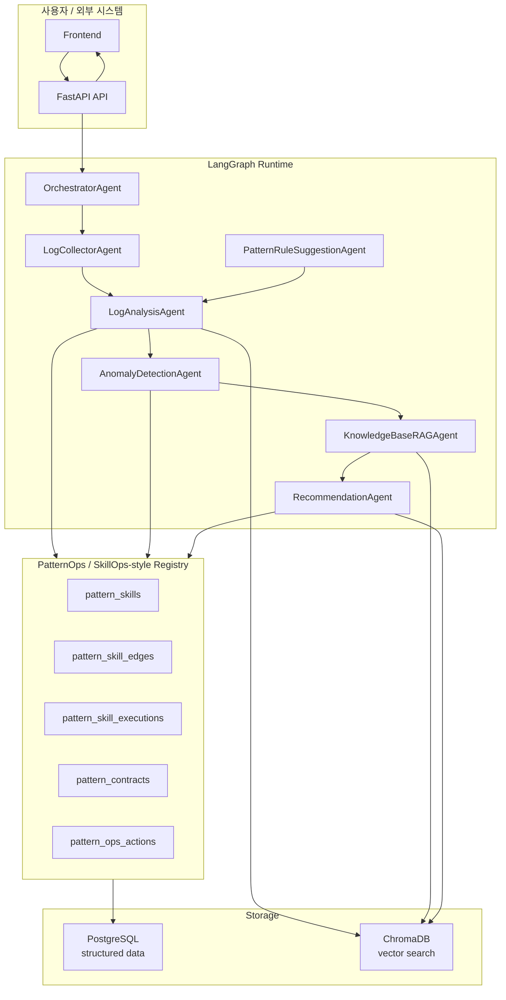

## 2. `/analyze` 실행 흐름

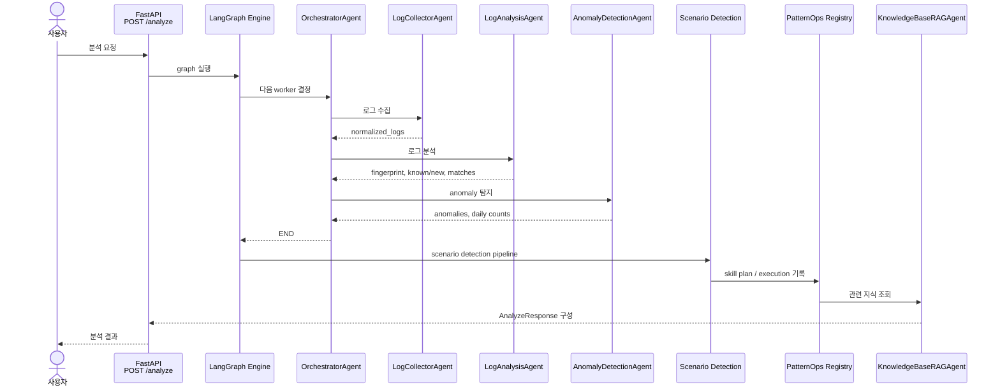

## 3. 개념적 Agent와 현재 구현 매핑

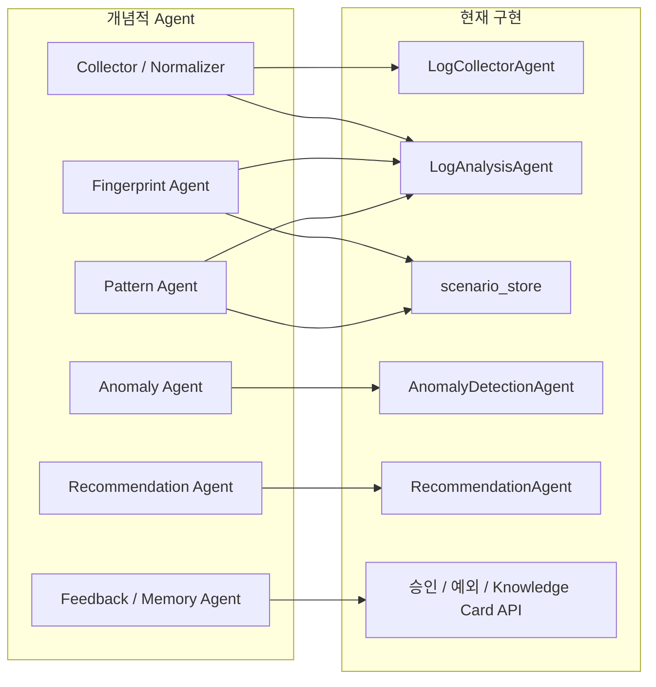

## 4. PatternOps Skill Graph

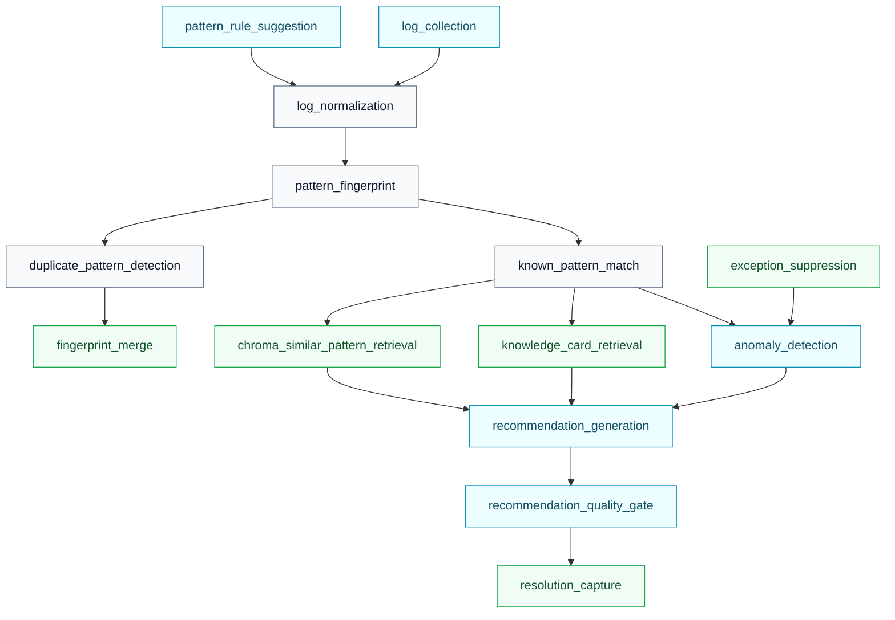

## 5. Skill 내부 계약 구조

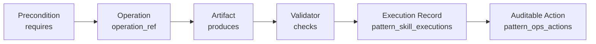

## 6. PatternOps Registry 데이터 모델

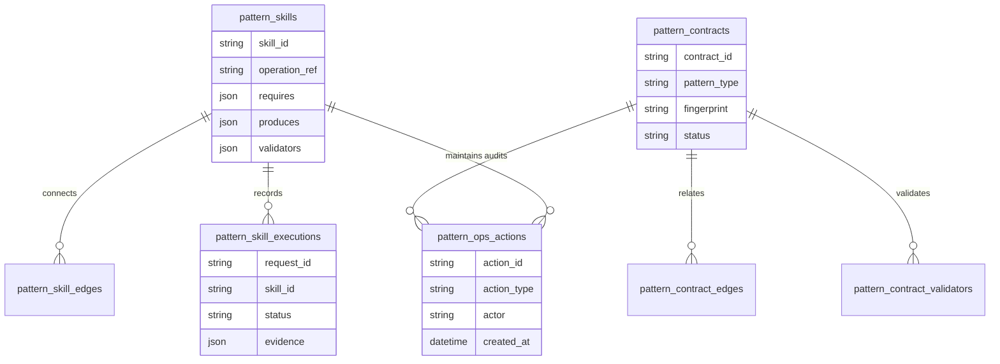

## 7. Embedding / Similarity 구조

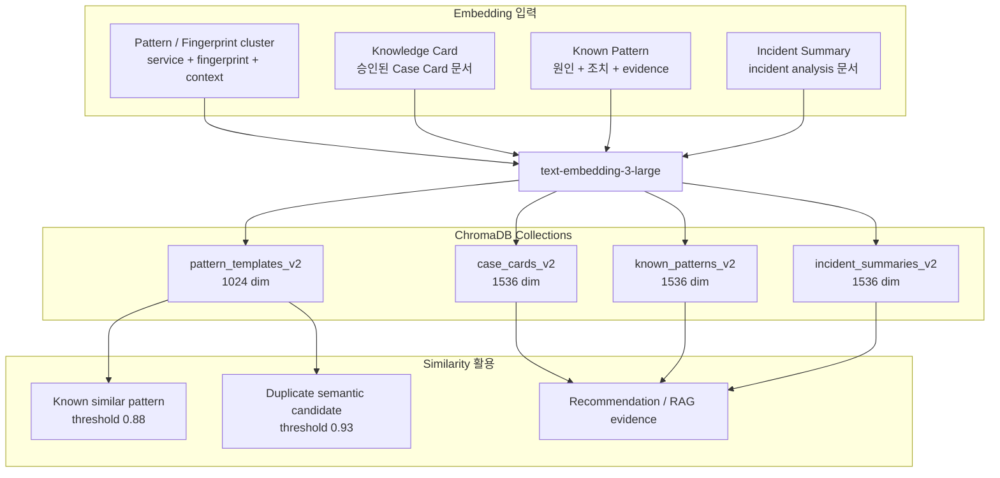

## 8. Time Window와 System State Vector

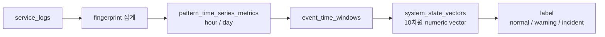

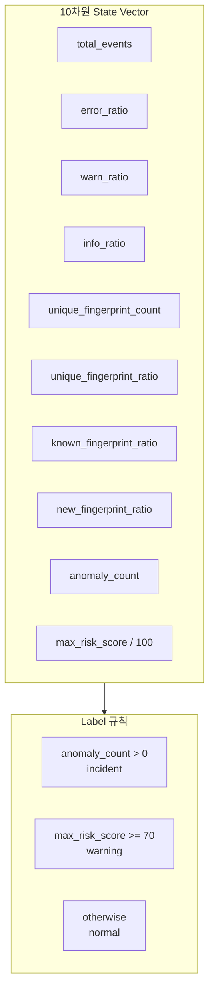

## 9. Baseline 예측 모델

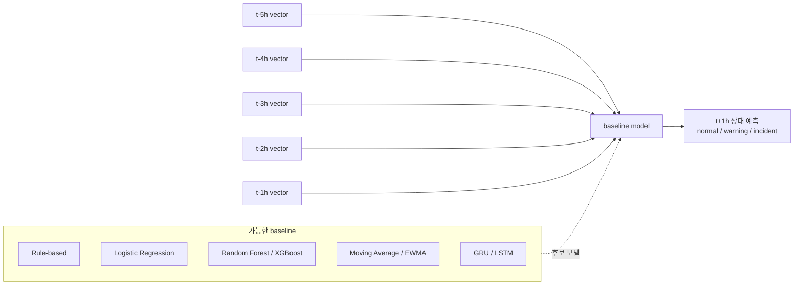

## 10. 현재 상태와 향후 Trajectory Modeling

```mermaid
flowchart LR
  subgraph Now["현재 존재"]
    N1["log parsing / template extraction"]
    N2["embedding"]
    N3["clustering / similarity search"]
    N4["incident pattern catalog"]
    N5["time-window aggregation"]
    N6["system state vector generation"]
  end

  subgraph Next["현실적인 다음 단계"]
    X1["state vector 수집 지속"]
    X2["dataset builder"]
    X3["최근 N시간 baseline"]
    X4["t+1h 상태 예측"]
    X5["feature 예측력 평가"]
    X6["필요 시 multi-scale window 추가"]
  end

  subgraph Later["나중에 검토"]
    L1["trajectory dataset"]
    L2["RecFM model class"]
    L3["training loop"]
    L4["forecast API"]
    L5["future trajectory result table"]
    L6["recursive consistency logic"]
  end

  Now --> Next --> Later
```

## 11. 점진적 진행 로드맵

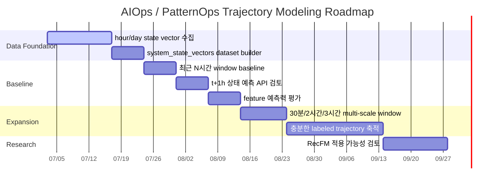
