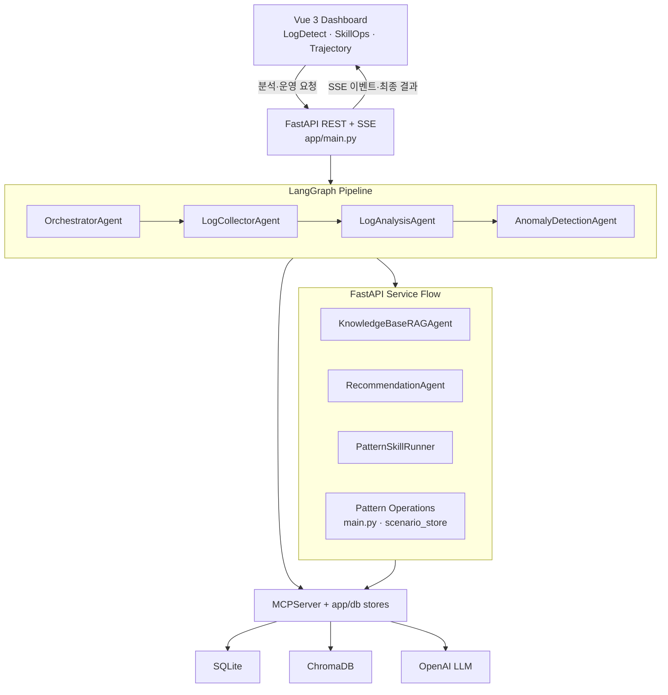

# Claude 작업 요청서: Agent 전체 프로세스 관측 및 고수준 추론 로그 화면

## 1. 작업 목적

LogDetect의 분석 요청이 Vue 대시보드에서 시작되어 FastAPI, LangGraph Agent, PatternOps, MCP 도구, SQLite·ChromaDB·OpenAI를 거쳐 최종 결과로 반환되기까지의 전체 과정을 한 화면에서 실시간으로 관찰할 수 있는 별도 UI를 구현한다.

현재 대시보드의 작은 `Agent 추론 · 스킬 활동 스트림`은 유지한다. 이번 작업에서는 이를 대체하지 말고, 상세 분석과 시연을 위한 독립적인 **Agent Process Observability** 화면을 추가한다.

단순한 상태 메시지 나열은 목표가 아니다.

- 지양: `Thinking... → Tool Call... → Done`
- 목표: `Planning: 12개 스킬을 평가하여 LogCollectorAgent를 다음 실행자로 선택`
- 목표: `Tool Call: sqlite.fetch_recent_log_entries 호출, 입력 필드 2개, 142건 반환, 38ms`
- 목표: `Validation: stable_fingerprint 통과, similarity_threshold 미통과`
- 목표: `Self-Correction: 품질 점수 72/100으로 기준 미달, 피드백을 반영해 2/3차 추천 재생성`

여기서 “고수준 추론 로그”란 모델의 비공개 Chain-of-Thought 원문이 아니다. 운영자가 실제 프로세스를 재현하고 판단 근거를 확인할 수 있도록 구조화한 **계획, 라우팅 결정, 도구 호출, 관측 결과, 검증, 재시도, 보정 결과의 요약 로그**를 의미한다.

## 2. 현재 아키텍처와 관측 대상

아래 흐름을 빠짐없이 관측 대상으로 포함한다.



반드시 표시할 프로세스 계층은 다음과 같다.

1. 사용자 요청 및 FastAPI 요청 접수
2. Orchestrator의 계획 생성과 다음 Agent 선택
3. LogCollectorAgent의 로그 조회와 fallback 여부
4. LogAnalysisAgent의 정규화, fingerprint, Known Pattern 매칭, 중복 후보 탐지
5. AnomalyDetectionAgent의 증가·감소·부재·신규 출현 판정과 suppression 적용
6. KnowledgeBaseRAGAgent의 Knowledge Card 및 Chroma 유사 항목 조회
7. RecommendationAgent의 후보 생성, 품질 평가, Self-Correction, fallback
8. PatternSkillRunner의 스킬 선택, 실행, validator 결과
9. MCP 도구 호출과 SQLite·ChromaDB·OpenAI 결과 요약
10. Pattern 운영 작업의 조회·승인·거절·저장 결과
11. SSE 전송, 부분 결과, 최종 결과 반환 및 전체 소요 시간

## 3. 현재 구현을 먼저 확인할 것

작업 시작 전에 아래 파일과 현재 변경 상태를 반드시 확인한다. 이미 구현된 이벤트를 삭제하거나 중복 구현하지 않는다.

### 백엔드 기준 파일

- `LOG_DETECT_AGENTS_BACK/app/reasoning_events.py`
  - `planning`, `tool_call`, `self_correction` 이벤트를 shared state와 SSE로 기록한다.
- `LOG_DETECT_AGENTS_BACK/app/state.py`
  - `evidence.agent_reasoning_events`가 존재한다.
- `LOG_DETECT_AGENTS_BACK/app/streaming.py`
  - 분석 요청별 SSE 큐와 이벤트 전송을 담당한다.
- `LOG_DETECT_AGENTS_BACK/app/mcp/client.py`
  - MCP Tool Call의 시작·완료·실패를 기록한다.
- `LOG_DETECT_AGENTS_BACK/app/graph/nodes.py`
  - Agent 실행과 1회 재시도 흐름을 담당한다.
- `LOG_DETECT_AGENTS_BACK/app/agents/orchestrator.py`
  - PatternOps 계획과 Agent 라우팅을 담당한다.
- `LOG_DETECT_AGENTS_BACK/app/agents/recommendation.py`
  - 최대 3회의 추천 품질 평가 및 Self-Correction이 구현되어 있다.
- `LOG_DETECT_AGENTS_BACK/app/patternops/runner.py`
  - 스킬 계획·실행·validator 기록을 담당한다.
- `LOG_DETECT_AGENTS_BACK/app/main.py`
  - `/analyze`, `/analyze/stream`, 추천 및 Pattern 운영 API를 결합한다.

### 프론트엔드 기준 파일

- `LOG_DETECT_AGENT_FRONT/src/services/streamingService.ts`
  - `stage`, `skill`, `reasoning`, `partial`, `final` SSE를 수신한다.
- `LOG_DETECT_AGENT_FRONT/src/stores/logDetectStore.ts`
  - 현재 활동 스트림과 분석 상태를 관리한다.
- `LOG_DETECT_AGENT_FRONT/src/components/dashboard/SkillActivityStreamPanel.vue`
  - 기존 요약 활동 패널이다. 삭제하지 않는다.
- `LOG_DETECT_AGENT_FRONT/src/types/agentTypes.ts`
  - `AgentReasoningEvent`와 `SharedState` 타입이 존재한다.
- `LOG_DETECT_AGENT_FRONT/src/router/index.ts`
  - 신규 독립 화면의 route를 추가할 위치다.

## 4. 구현 범위

### 4.1 별도 화면과 라우팅

신규 route와 view를 추가한다.

- 권장 route: `/agent-observability`
- 권장 view: `src/views/AgentObservabilityDashboard.vue`
- 기존 상단 또는 공통 내비게이션에서 화면으로 이동할 수 있어야 한다.
- 기존 LogDetect, SkillOps, Trajectory 화면의 기능과 레이아웃을 깨뜨리지 않는다.

### 4.2 화면 구성

한 화면에 지나치게 많은 원문을 펼치지 말고, 다음 영역으로 구성한다.

#### A. 실행 선택 및 요약 헤더

- `request_id` 또는 trace 선택
- 대상 서비스, 분석 기준일, 시작·종료 시각
- 전체 상태: running, completed, degraded, failed
- 전체 소요 시간
- 실행 Agent 수, Tool Call 수, 재시도 수, 실패 validator 수
- 실시간 연결 상태: SSE connected, reconnecting, completed

#### B. 전체 프로세스 타임라인

- 시간순 정렬을 기본으로 한다.
- 이벤트마다 시각, 경과 시간, 계층, Agent/컴포넌트, 이벤트 유형, 상태를 표시한다.
- `Planning`, `Routing`, `Agent`, `Skill`, `Tool Call`, `Observation`, `Validation`, `Self-Correction`, `Persistence`, `SSE` 유형을 색상과 아이콘으로 구분한다.
- Agent와 Tool Call의 부모·자식 관계를 들여쓰기 또는 연결선으로 표현한다.
- 실행 중인 항목은 갱신하고, 완료 이벤트를 별도 중복 행으로 계속 쌓지 않아도 된다. 단, 시작·완료 시각과 duration은 보존한다.
- 자동 스크롤 on/off와 일시 정지 기능을 제공한다.

#### C. 이벤트 상세 패널

타임라인 항목을 선택하면 다음 정보를 표시한다.

- 제목과 사람이 읽을 수 있는 요약
- Agent, component, layer, event type
- status, timestamp, duration, attempt/max attempts
- 계획에서 선택된 스킬과 다음 Agent
- Tool 이름, 입력 **필드명**, 결과 타입·건수·크기
- validator 이름, 통과 여부, 실패 사유
- 품질 점수, 통과 기준, Self-Correction 발생 이유
- 관련 fingerprint, Knowledge Card ID, pattern ID 같은 안전한 evidence reference
- 오류 유형과 graceful degradation 또는 fallback 여부

#### D. 필터와 검색

- Agent별 필터
- 이벤트 유형별 필터
- 상태별 필터
- SQLite, ChromaDB, OpenAI 등 외부 의존성별 필터
- request ID, Tool 이름, fingerprint, 이벤트 제목 검색
- `실패·재시도만 보기` 빠른 필터

#### E. 프로세스 맵

첨부 아키텍처 그림의 주요 컴포넌트를 간단한 lane 또는 node 형태로 표현한다.

- 현재 실행 중인 컴포넌트 강조
- 완료, 실행 중, 실패, 미실행 상태 구분
- 노드 선택 시 해당 컴포넌트의 타임라인 이벤트만 필터링
- 정적인 장식이 아니라 실제 이벤트 상태에서 파생된 UI여야 한다.

## 5. 고수준 이벤트 계약

현재 `AgentReasoningEvent`를 호환성 있게 확장하거나, 공통 `AgentTraceEvent`를 새로 정의한다. 기존 필드는 깨뜨리지 않는다.

권장 스키마는 다음과 같다.

```json
{
  "event_id": "req-123:tool:7",
  "request_id": "req-123",
  "trace_id": "req-123",
  "span_id": "span-tool-7",
  "parent_span_id": "span-log-collector",
  "sequence": 7,
  "timestamp": "2026-07-16T10:20:30.123Z",
  "duration_ms": 38,
  "layer": "data_access",
  "component": "MCPClient",
  "agent_name": "LogCollectorAgent",
  "kind": "tool_call",
  "event_type": "tool.completed",
  "status": "completed",
  "title": "SQLite 최근 로그 조회 완료",
  "summary": "sqlite.fetch_recent_log_entries가 142건을 반환했습니다.",
  "input_summary": {
    "field_names": ["service_names", "limit"]
  },
  "output_summary": {
    "type": "list",
    "count": 142
  },
  "decision_summary": null,
  "evidence_refs": [],
  "attempt": 1,
  "max_attempts": 2,
  "error": null,
  "fallback_used": false
}
```

### 필수 이벤트 유형

#### 요청 및 API

- `request.accepted`
- `request.validated`
- `request.completed`
- `request.failed`
- `sse.connected`
- `sse.partial_emitted`
- `sse.final_emitted`

#### Planning 및 라우팅

- `plan.generated`
- `plan.skill_selected`
- `route.agent_selected`
- `route.end_selected`
- `plan.skipped`

#### Agent 및 Skill

- `agent.started`
- `agent.completed`
- `agent.retrying`
- `agent.failed`
- `skill.planned`
- `skill.started`
- `skill.completed`
- `skill.failed`
- `validator.passed`
- `validator.failed`

#### Tool 및 데이터 접근

- `tool.started`
- `tool.completed`
- `tool.failed`
- `retrieval.completed`
- `persistence.completed`
- `persistence.skipped`

#### LLM 및 Self-Correction

- `llm.generation_started`
- `llm.generation_completed`
- `quality.evaluated`
- `self_correction.started`
- `self_correction.completed`
- `fallback.activated`

## 6. 로그 내용 품질 기준

각 이벤트는 “무엇을 했는지”뿐 아니라 아래 중 가능한 내용을 포함해야 한다.

- 왜 이 Agent 또는 스킬이 선택되었는가
- 어떤 전제조건이 충족 또는 미충족되었는가
- 어떤 입력 구조를 사용했는가
- 어떤 결과가 관측되었는가
- 어떤 validator가 통과 또는 실패했는가
- 실패 후 재시도·건너뜀·fallback 중 무엇을 선택했는가
- 최종 판단에 연결된 evidence reference는 무엇인가

좋은 예시는 다음과 같다.

```text
Planning · COMPLETED
전체 14개 PatternOps 스킬 중 현재 scope와 전제조건을 만족한 6개를 선택했습니다.
다음 Agent: LogAnalysisAgent
선택 근거: normalized_logs_available, raw_log_message
```

```text
Tool Call · COMPLETED · 38ms
sqlite.fetch_recent_log_entries
입력 필드: service_names, limit
관측 결과: list 142건 반환
호출 Agent: LogCollectorAgent
```

```text
Validation · FAILED
validator: similarity_threshold
관측값: 0.71 / 기준값: 0.85
결정: 자동 병합하지 않고 duplicate candidate 승인 대기로 전환
```

```text
Self-Correction · RUNNING · attempt 2/3
직전 추천 품질 점수 72/100으로 통과 기준 80점에 미달했습니다.
보완 항목: 근거 연결, 실행 가능한 검증 단계
결정: 평가 피드백을 포함하여 추천 후보를 재생성합니다.
```

## 7. 보안 및 비노출 기준

다음 정보는 화면, SSE payload, 로컬 trace buffer에 원문으로 남기지 않는다.

- 모델의 비공개 Chain-of-Thought 또는 scratchpad
- system prompt와 전체 user prompt 원문
- OpenAI API key, embedding key, LangSmith key 등 시크릿
- 실제 로그의 개인정보·토큰·Authorization header
- MCP Tool 인자의 전체 값과 원시 DB row
- LLM의 원본 전체 요청·응답
- 전체 stack trace 원문

대신 허용된 구조 요약과 마스킹된 reference를 사용한다.

- Tool 입력은 필드명, 타입, 개수만 표시
- 결과는 타입, 건수, 크기, 안전한 ID만 표시
- 로그 메시지는 fingerprint 또는 마스킹된 대표 템플릿으로 표시
- 오류는 exception type과 안전한 요약만 표시
- 필요하면 공통 redaction 함수를 추가하고 테스트한다.

## 8. 백엔드 구현 요구사항

1. 현재 `record_reasoning_event`를 범용 trace event 기록기로 확장하되 기존 호출과 응답 호환성을 유지한다.
2. 모든 이벤트에 서버 기준 timestamp와 안정적인 sequence를 부여한다.
3. 시작·완료 이벤트는 `span_id`로 연결하고 duration을 계산할 수 있어야 한다.
4. Agent retry는 최초 실행과 재시도를 구분할 수 있게 attempt를 기록한다.
5. PatternSkillRunner의 precondition, selected reason, validator 결과를 이벤트로 보낸다.
6. SQLite, ChromaDB, OpenAI Tool Call을 같은 스키마로 기록한다.
7. KnowledgeBaseRAGAgent와 RecommendationAgent처럼 LangGraph 밖의 FastAPI 서비스 흐름도 빠뜨리지 않는다.
8. Pattern 승인·거절·예외 등록·정상 편입 등 운영 API도 요청 단위 trace를 생성한다.
9. SSE 재연결이나 최종 REST 응답 시 중복 이벤트가 생기지 않도록 `event_id`로 dedupe한다.
10. trace 기록 실패가 본 분석 흐름을 실패시키지 않도록 graceful degradation을 보장한다.

### Trace 조회 범위

MVP에서는 다음을 지원한다.

- 현재 실행의 실시간 SSE trace
- 완료된 현재 분석 결과의 `evidence.agent_reasoning_events`
- 동일 브라우저 세션에서 최근 실행 선택

새 DB 테이블이나 인프라를 임의로 추가하지 않는다. 서버 재시작 후에도 남는 장기 이력 저장이 필요하다고 판단되면 먼저 설계와 영향 범위를 문서화하고 사용자 승인을 요청한다.

## 9. 프론트엔드 구현 요구사항

1. API 응답과 SSE 이벤트의 TypeScript 타입을 정확히 정의한다. `any`를 사용하지 않는다.
2. 현재 `logDetectStore`의 분석 결과와 충돌하지 않도록 trace 전용 상태 또는 별도 Pinia store를 검토한다.
3. 이벤트는 `event_id` 기준으로 dedupe하고 `sequence` 기준으로 안정적으로 정렬한다.
4. 시작 이벤트와 완료 이벤트가 나뉘어 오면 동일 span을 갱신하는 방식을 우선한다.
5. SSE 연결 실패 시 REST 최종 결과의 trace로 복원하고 화면에 fallback 상태를 표시한다.
6. 500개 이상의 이벤트에서도 필터와 스크롤이 현저하게 느려지지 않게 한다.
7. 화면 폭이 좁을 때는 상세 패널을 drawer로 전환한다.
8. 상태를 색상만으로 구분하지 말고 텍스트와 아이콘을 함께 사용한다.
9. 기존 활동 스트림에는 요약만 유지하고, `상세 추론 로그 보기` 링크를 제공한다.

## 10. 예상 변경 파일

실제 구조를 먼저 확인하고 최소 범위로 조정한다.

### 백엔드

- `app/reasoning_events.py`
- `app/state.py`
- `app/streaming.py`
- `app/graph/nodes.py`
- `app/agents/orchestrator.py`
- `app/agents/log_collector.py`
- `app/agents/log_analysis.py`
- `app/agents/anomaly_detection.py`
- `app/agents/knowledge_base_rag.py`
- `app/agents/recommendation.py`
- `app/patternops/runner.py`
- `app/mcp/client.py`
- 필요한 Pydantic schema와 테스트

### 프론트엔드

- `src/router/index.ts`
- `src/types/agentTypes.ts`
- `src/services/streamingService.ts`
- trace 전용 store 또는 기존 store의 독립 영역
- `src/views/AgentObservabilityDashboard.vue`
- `src/components/observability/*`
- 공통 내비게이션 및 기존 활동 패널 링크

## 11. 테스트 요구사항

### 백엔드

- Planning 이벤트에 선택 Agent와 선택 스킬이 포함되는지
- Tool Call에 인자 값과 원시 결과가 노출되지 않는지
- Tool 성공·실패·재시도 시 status와 attempt가 정확한지
- validator 통과·실패 이벤트가 생성되는지
- Self-Correction 2회 이상 수행 시 점수와 attempt가 순서대로 기록되는지
- LangGraph 밖의 Knowledge RAG·추천·운영 API 이벤트도 기록되는지
- trace 기록 실패가 분석 결과를 실패시키지 않는지
- request별 이벤트가 서로 섞이지 않는지

### 프론트엔드

- route 진입과 내비게이션
- SSE 이벤트 수신·정렬·dedupe
- 필터·검색·실패 항목만 보기
- 이벤트 선택 시 상세 패널 표시
- 시작 이벤트가 완료 이벤트로 갱신되는지
- SSE 실패 후 최종 REST trace 복원
- 빈 상태, 실행 중, 완료, degraded, failed 상태
- 모바일 및 좁은 화면 레이아웃

## 12. 완료 조건

다음 조건을 모두 만족해야 완료로 본다.

- 별도 Agent Observability 화면에서 첨부 아키텍처의 전체 주요 계층을 확인할 수 있다.
- 분석 실행 중 이벤트가 실시간으로 추가·갱신된다.
- Planning, Routing, Agent, Skill, Tool Call, Validation, Self-Correction, Persistence 이벤트가 구분된다.
- 단순 `Thinking...` 메시지가 아니라 선택 근거, 관측 결과, 검증 및 보정 결과가 표시된다.
- 내부 Chain-of-Thought, 시크릿, 원시 로그, Tool 인자 값은 노출되지 않는다.
- 기존 LogDetect·SkillOps·Trajectory 기능과 API 계약이 깨지지 않는다.
- 백엔드 테스트와 Ruff, 프론트 빌드와 lint가 통과한다. 기존 환경 문제로 실패하면 원인과 미검증 범위를 명확히 보고한다.
- 변경 전후 `git status`를 확인하고 사용자 소유의 DB·문서·fixture 변경을 건드리지 않는다.

## 13. Claude 작업 지시문

아래 문장을 Claude에게 이 문서와 함께 전달한다.

> 이 작업요청서를 기준으로 현재 저장소 구현을 먼저 조사한 뒤 Agent 전체 프로세스 관측 화면을 구현해주세요. 기존 `reasoning` SSE와 `agent_reasoning_events`를 재사용하고, 단순 상태 로그가 아니라 계획·선택 근거·Tool 관측 결과·validator·재시도·Self-Correction을 구조화해 보여주세요. 모델의 내부 Chain-of-Thought나 원시 프롬프트·로그·시크릿은 노출하지 마세요. 기존 사용자 변경을 보존하고, 영향 범위에 맞는 백엔드 테스트와 Ruff, 프론트 build와 lint를 실행한 뒤 변경 파일과 검증 결과를 보고해주세요.
