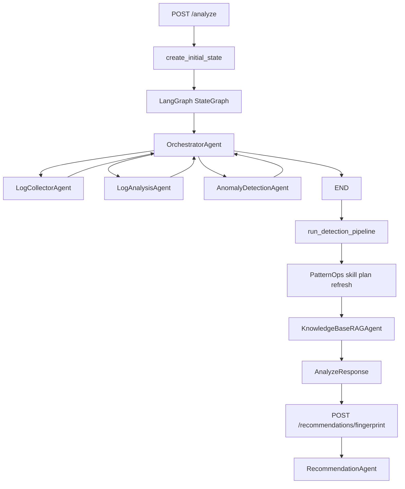

# PoC Core Implementation

작성일: 2026-07-05

이 문서는 현재 `LOG_DETECT_AGENTS_BACK`에 실제 구현된 PoC 기능을 기준으로, 동작 원리와 사용 기술을 정리한 것이다. 본 PoC는 FastAPI 기반 백엔드에서 LangGraph 스타일의 멀티 에이전트 흐름을 실행하고, SQLite 로그 저장소와 ChromaDB 기반 지식 검색을 결합해 장애 징후 탐지, 패턴 분류, 영향 평가용 근거 수집, 추천 생성까지 이어지는 AIOps 분석 흐름을 제공한다.

현재 구현 범위는 로그 수집, 로그 정규화, Fingerprint 생성, Known/New Pattern 판정, 이상 탐지, PatternOps/SkillOps 실행 계획, Knowledge Card/RAG, 추천 생성 및 품질 검증이다. 상위 기획상 Source Code Analysis Agent 개념은 있으나, 현재 활성 API 흐름에는 별도 코드 영향 분석 에이전트가 실행되지 않는다.

## 핵심 구현 내용

### 1.1 에이전트 워크플로우 (Agent Workflow)

**구현 기능:** Orchestrator 기반 로그 분석 멀티 에이전트 워크플로우

**동작 원리:** 사용자가 `POST /analyze`로 서비스명, 분석 목표, 분석 일자를 전달하면 FastAPI가 `SharedState` 초기 상태를 생성한다. LangGraph `StateGraph`는 `OrchestratorAgent`를 시작점으로 실행되며, 오케스트레이터가 다음 실행 대상 에이전트를 `LogCollectorAgent -> LogAnalysisAgent -> AnomalyDetectionAgent` 순서로 선택한다. 각 worker agent는 실행 후 다시 오케스트레이터로 돌아가고, 모든 agent가 완료되면 `END`로 종료된다.

워크플로우가 종료된 뒤 API 계층에서는 대시보드 근거 생성을 위해 `run_detection_pipeline()`을 추가 실행한다. 이 단계에서 fingerprint 집계, Known/New Pattern 판정, anomaly, risk, duplicate pattern candidate, time-window metric, system state vector 등이 보강된다. `/analyze` 기본 흐름에서는 `RecommendationAgent`가 자동 실행되지 않고 `skipped_agents`에 기록되며, 사용자가 특정 fingerprint를 선택해 `POST /recommendations/fingerprint`를 호출할 때 추천 생성이 실행된다.

**주요 기술:** FastAPI, LangGraph `StateGraph`, Python `TypedDict` 기반 `SharedState`, Orchestrator 패턴, retry/fallback 처리, LangSmith 또는 로컬 trace 이벤트 기록



### 1.2 도구(Tool) 및 함수 연동

**구현 기능:** 인프로세스 MCP Tool Registry를 통한 SQLite, ChromaDB, OpenAI, Microsoft Graph 연동

**동작 원리:** 에이전트는 외부 의존성을 직접 호출하지 않고 `get_mcp_client().call_tool(tool_name, arguments)` 형태로 도구를 호출한다. `MCPServer`는 tool name을 handler 함수에 매핑하며, 현재 등록된 주요 도구는 다음과 같다.

| 도구 | 역할 |
| --- | --- |
| `sqlite.fetch_recent_log_entries` | 서비스별 최신 구조화 로그 조회 |
| `sqlite.save_log_analysis` | 로그 분석 요약 저장 |
| `sqlite.save_recommendation_result` | 사용자가 저장한 추천 이력 저장 |
| `chromadb.find_related_analyses` | 유사 분석/Knowledge Card 검색 |
| `chromadb.save_analysis_document` | 최종 답변, Known Pattern, Knowledge Card 문서 저장 |
| `openai.generate_text` | 추천 생성 및 추천 품질 평가용 LLM 호출 |
| `msgraph.request` | Microsoft Graph API 호출 래퍼 |

도구 입력은 FastAPI 요청 모델과 각 tool handler에서 타입을 보정한다. 예를 들어 분석 요청은 `AnalyzeRequest`, 추천 저장은 `RecommendationSaveRequest`, 예외 등록은 `ExceptionRegisterRequest`처럼 Pydantic 모델로 API 경계에서 검증된다. 추천 생성 결과는 LLM 응답을 그대로 사용하지 않고 JSON schema 형태로 파싱한 뒤 `recommended_actions`, `verification_steps`, `prevention_steps` 등 필수 필드를 코드에서 재검증한다.

**주요 기술:** FastAPI, Pydantic `BaseModel`/`Field`, in-process MCP pattern, SQLite, ChromaDB, OpenAI Chat/Embeddings API, Microsoft Graph integration wrapper

### 1.3 데이터 및 메모리 (RAG & Context)

**구현 기능:** Fingerprint, Known Pattern, Knowledge Card, 최종 분석 답변을 ChromaDB에 저장하고 유사 사례를 검색하는 RAG 메모리

**동작 원리:** 로그 메시지는 변동값(UUID, 날짜, 숫자, URL, 파일 경로, request id 등)을 제거하거나 일반화한 뒤 fingerprint로 묶인다. 신규 패턴은 `pattern_clusters` 또는 `pattern_templates_v2` 컬렉션에 저장되며, 승인된 Known Pattern과 Knowledge Card는 `known_patterns_v2`, `case_cards_v2`, `incident_summaries_v2`로 분리 저장된다.

임베딩 API 키가 설정되어 있으면 OpenAI 또는 Azure OpenAI 임베딩을 사용해 v2 컬렉션에 저장한다. 설정이 없거나 쿼리 실패 시에는 기존 v1 ChromaDB 텍스트 기반 경로로 폴백한다. Knowledge Card는 사용자가 추천 결과를 승인할 때 생성되며, 원인, 조치, 실제 해결 방법, 검증 방법, 재발 방지 항목을 sectioned case card 문서로 구성해 추후 추천 생성의 근거로 재사용한다.

**주요 기술:** ChromaDB PersistentClient, OpenAI `text-embedding-3-large`, Azure OpenAI embedding option, similarity search, Knowledge Card, fingerprint normalization, batch embedding, fallback retrieval

## 주요 구현 세부사항

### 로그 수집 및 정규화

`LogCollectorAgent`는 SQLite의 `service_logs`에서 서비스별 최근 로그를 조회하고, `normalized_logs`와 `stack_traces`를 `SharedState.evidence`에 기록한다. 로그가 없는 경우에는 분석 목표와 서비스명을 기반으로 fallback 로그를 생성해 전체 파이프라인이 빈 입력으로 중단되지 않게 한다.

정규화는 두 계층에서 수행된다. `LogAnalysisAgent` 내부 정규화는 실시간 에이전트 분석용으로 UUID, timestamp, duration, IP, request id, user id, 숫자 등을 일반화한다. `scenario_store.normalize_log_text()`는 PoC 시나리오 분석용으로 URL, Windows path, JSON payload 값, 날짜, hash, compiler-generated member, line number까지 더 폭넓게 정규화한다.

### Fingerprint 및 패턴 판정

정규화된 메시지는 hash 기반 fingerprint로 변환된다. 이후 DB에 등록된 Known Pattern, suppression config, PatternOps contract, ChromaDB 유사 패턴을 함께 비교해 다음 상태로 분류한다.

| 상태 | 의미 |
| --- | --- |
| `known_exact` | 기존 Known Pattern 또는 contract와 fingerprint가 직접 일치 |
| `known_similar` | ChromaDB/하이브리드 유사도로 승인된 패턴과 유사 |
| `observed_existing` | 이전에 관측된 fingerprint 재등장 |
| `new_pattern` / `new_pattern_candidate` | 아직 등록되지 않은 신규 패턴 |
| `known_suppressed` | 예외 또는 suppression 정책에 따라 분석/위험 산정에서 제외 |

중복 후보 탐지는 메시지 구조 유사도, token 유사도, stacktrace/metadata, ChromaDB embedding similarity를 조합한 hybrid score를 사용한다. 승인된 후보는 normalization rule로 저장되고, 기존 fingerprint들은 canonical fingerprint로 병합되며 alias가 남는다.

### 이상 탐지 및 위험 근거

`AnomalyDetectionAgent`는 suppression 처리된 로그를 제외한 뒤 패턴 발생 증가, 감소, 부재, 신규 패턴 출현을 기준으로 anomaly를 산출한다. `scenario_store.run_detection_pipeline()`은 추가로 일자별 집계, fingerprint별 risk score, event time window, 10차원 system state vector를 생성해 대시보드와 추천 근거에 사용한다.

현재 구현된 risk score는 서비스 중요도, 로그 레벨, 발생 횟수, anomaly 상태, Known/New 여부를 조합하는 결정론적 점수화 방식이다. 인프라 변경, 임의 DB 스키마 변경, 시크릿 회전, 파괴적 운영 명령은 추천 프롬프트와 품질 평가 hard-fail 조건에서 금지된다.

### Recommendation Agent 품질 게이트

`RecommendationAgent`는 선택된 fingerprint의 evidence bundle, related Knowledge Card, known pattern, stacktrace, anomaly, risk score를 LLM에 전달해 JSON 구조의 추천을 생성한다. 생성 결과는 다음 조건을 만족해야 한다.

- `recommended_actions`는 비어 있으면 안 되며 `priority`, `action`, `owner`를 포함해야 한다.
- 각 조치는 `reason`, `target`, `expected_effect`, `risk`를 포함해야 한다.
- `verification_steps`는 최소 2개 이상의 구체적 검증 항목이어야 한다.
- `prevention_steps`가 비어 있으면 품질 게이트에서 실패한다.
- root cause는 fingerprint, message, stack trace 등 evidence bundle의 실제 근거를 인용해야 한다.
- 금지된 운영 조치가 포함되면 hard fail로 처리한다.

품질 평가는 LLM 기반 evaluator가 100점 rubric으로 수행하며, 80점 이상이고 hard-fail 조건이 없을 때 통과한다. 최대 3회 재생성을 시도하고, 계속 실패하거나 JSON 파싱이 불가능하면 fallback recommendation을 반환한다.

## 주요 문제 해결 및 기술 리서치

| 이슈 구분 | 문제 상황 및 원인 | 리서치 및 해결 과정 (Reference & Solution) |
| --- | --- | --- |
| 워크플로우 | 단순 순차 함수 호출만으로는 에이전트별 실행 상태, 실패, skip 여부를 추적하기 어려웠다. | **리서치:** LangGraph Graph API의 node/edge/state/conditional edge 구조 확인. Reference: https://docs.langchain.com/oss/python/langgraph/quickstart, https://docs.langchain.com/oss/python/langgraph/graph-api. **적용:** `StateGraph(SharedState)`와 `OrchestratorAgent`를 사용해 worker 실행 후 오케스트레이터로 복귀하는 구조를 구현하고, `completed_agents`, `pending_agents`, `skipped_agents`를 상태에 기록했다. |
| 도구 연동 | API 요청과 tool 호출 인자 형식이 섞이면 런타임 오류가 발생하기 쉽다. | **리서치:** FastAPI/Pydantic request body 검증 방식 확인. Reference: https://fastapi.tiangolo.com/tutorial/body/. **적용:** FastAPI 경계에서는 `AnalyzeRequest`, `RecommendationSaveRequest`, `ApprovalRequest` 등 Pydantic 모델로 검증하고, 내부 tool registry에서는 `arguments`를 handler별로 명시 변환했다. |
| 프롬프트/환각 | LLM이 로그 근거와 무관한 원인 또는 금지된 운영 조치를 추천할 수 있다. | **리서치:** 구조화 JSON 응답, evidence-grounded prompting, evaluator loop 방식 검토. **적용:** 추천 생성 prompt에 evidence bundle과 금지 조치를 명시하고, 별도 LLM evaluator와 코드 기반 hard-fail check를 추가했다. 품질 점수 80점 미만이면 최대 3회 재생성한다. |
| RAG 검색 | 단일 컬렉션에 모든 문서를 저장하면 Pattern Template, Knowledge Card, Incident Summary의 성격이 섞여 검색 품질과 metadata 관리가 불안정해진다. | **리서치:** ChromaDB collection add/query 동작과 query result shape 확인. Reference: https://docs.trychroma.com/docs/collections/add-data, https://docs.trychroma.com/docs/querying-collections/query-and-get. **적용:** `pattern_templates_v2`, `case_cards_v2`, `known_patterns_v2`, `incident_summaries_v2`로 목적별 컬렉션을 분리하고, query 결과는 similarity 기준으로 정렬/병합했다. |
| 임베딩 비용/성능 | `text-embedding-3-large` 기본 차원은 크지만, 패턴 템플릿 검색은 긴 문서 검색보다 작은 차원으로도 충분할 수 있다. | **리서치:** OpenAI embedding v3의 `dimensions` parameter와 기본 차원 확인. Reference: https://developers.openai.com/api/docs/guides/embeddings. **적용:** 패턴 템플릿은 기본 1024차원, Case Card/Incident 문서는 1536차원으로 분리했다. 환경 변수로 `OPENAI_PATTERN_EMBEDDING_DIMENSIONS`, `OPENAI_CASE_CARD_EMBEDDING_DIMENSIONS`를 조정할 수 있다. |
| 중복 패턴 | request id, WorkID, 숫자, 파일 경로 등 volatile 값 때문에 같은 장애가 여러 fingerprint로 분리됐다. | **리서치:** 정규식 기반 template normalization, 구조 유사도, embedding similarity 조합 방식 검토. **적용:** `normalize_log_text()`, `PatternRuleSuggestionAgent`, duplicate candidate detection, manual merge API를 구현했다. 승인된 rule은 재분석 시 canonical fingerprint로 병합된다. |
| 예외 처리 | 이미 승인된 ignore fingerprint가 이후 분석에서 다시 risk/anomaly로 노출될 수 있다. | **리서치:** suppression registry와 known pattern registry를 분리하는 운영 패턴 검토. **적용:** `/exceptions` API와 `exception_registry` 테이블을 추가하고, run_detection_pipeline과 anomaly detection에서 suppressed key를 제외하도록 처리했다. |
| 저장/재사용 | 추천 결과를 자동으로 모두 지식화하면 검증되지 않은 답변이 RAG에 누적될 위험이 있다. | **리서치:** human-in-the-loop approval 후 case memory로 저장하는 패턴 검토. **적용:** `/approvals`에서 사용자가 승인한 결과만 Knowledge Card로 변환하고, `resolution_method`와 검증/재발 방지 항목을 포함한 RAG 문서로 저장한다. |

## 핵심 동작 검증

### 검증 시나리오 1: 날짜별 서비스 로그 분석

**입력:** `POST /analyze`

```json
{
  "service_name": "payment-api",
  "goal": "service log anomaly investigation",
  "analysis_date": "2026-06-16",
  "save_to_chromadb": false
}
```

**에이전트 동작:**

1. `AnalyzeRequest`가 service name과 날짜를 검증한다.
2. `create_initial_state()`가 `SharedState`를 생성한다.
3. `OrchestratorAgent`가 `LogCollectorAgent`, `LogAnalysisAgent`, `AnomalyDetectionAgent` 순서로 실행한다.
4. `run_detection_pipeline("payment-api", analysis_date="2026-06-16")`이 해당 날짜의 `service_logs`만 처리한다.
5. fingerprint, anomaly, summary, PatternOps skill plan, RAG related knowledge가 응답에 포함된다.

**대표 결과:** 테스트 기준으로 `payment-api`의 2026-06-16 로그만 처리했을 때 `summary.total_logs=1`, `summary.processed_new_logs=1`, 첫 fingerprint message가 `"target day failure"`로 유지되며, 다른 날짜/다른 서비스 로그는 제외된다.

### 검증 시나리오 2: 중복 fingerprint 후보 생성 및 승인 병합

**입력 로그:**

```text
SetImpersonation() userID:1111393, deptID:, CurrentUserInfo.UserID:1108366, CurrentUserInfo.ImpersonationAdminID
SetImpersonation() userID:1103450, deptID:, CurrentUserInfo.UserID:, CurrentUserInfo.ImpersonationAdminID
SetImpersonation() userID:1112074, deptID:00004787, CurrentUserInfo.UserID:, CurrentUserInfo.ImpersonationAdminID
```

**에이전트 동작:**

1. `normalize_log_text()`가 숫자와 volatile 값을 일반화한다.
2. 최초 분석에서는 3개의 fingerprint가 생성된다.
3. duplicate detector가 같은 구조의 패턴임을 감지하고 candidate 1건을 생성한다.
4. 사용자가 candidate를 승인하면 `save_pattern_normalization_rule()`로 regex/template rule을 저장한다.
5. `merge_duplicate_pattern_candidate()`가 canonical fingerprint로 병합하고 alias를 기록한다.
6. 재분석 시 fingerprint 수가 1개로 축소되고 Known Pattern으로 판정된다.

**대표 결과:** 테스트 기준으로 승인 전 `total_fingerprints=3`, duplicate candidate 1건이 생성된다. 승인/병합 후 재분석에서는 `summary.total_fingerprints=1`, `summary.known_patterns=1`, `summary.new_patterns=0`이 된다.

### 검증 시나리오 3: 승인된 추천을 Knowledge Card로 저장하고 RAG에 재사용

**입력:** `POST /approvals`

```json
{
  "fingerprint": "FP-123",
  "cause": "결제 API provider timeout",
  "recommendation": "PaymentClient timeout 및 retry 정책을 점검한다.",
  "resolution_method": "provider SLA 확인 후 timeout 설정을 조정했다.",
  "action": "approved",
  "confidence": "HIGH"
}
```

**에이전트 동작:**

1. `/approvals`가 승인 요청을 받는다.
2. `approve_result()`가 fingerprint context를 조회한다.
3. 원인, 추천, 실제 해결 방법, 증상, evidence, verification, prevention을 포함한 Case Card 문서를 생성한다.
4. SQLite `knowledge_cards`에 저장하고 ChromaDB에는 `knowledge-card:{card_id}` 문서로 저장한다.
5. 이후 `/recommendations/fingerprint` 호출 시 exact fingerprint card와 ChromaDB 유사 card를 함께 조회한다.

**대표 결과:** 테스트 기준으로 Knowledge Card는 `KC-` prefix의 card id를 가지며, `metadata.schema_version`은 `rag-case-card-v1`이다. 저장 성공 시 `embedding_status="embedded"`로 기록되고, 추천 생성 evidence bundle에는 참조된 Knowledge Card ID가 포함된다.

### 검증 시나리오 4: LLM 추천 생성 및 품질 게이트

**입력:** `POST /recommendations/fingerprint`

```json
{
  "service_name": "payment-api",
  "fingerprint": "FP-TIMEOUT",
  "analysis_date": "2026-06-16"
}
```

**에이전트 동작:**

1. 선택된 fingerprint의 로그, stacktrace, anomaly, risk, known pattern, related Knowledge Card를 evidence bundle로 구성한다.
2. `RecommendationAgent`가 OpenAI tool을 호출해 JSON 추천안을 생성한다.
3. 파서가 필수 필드와 action schema를 검증한다.
4. LLM evaluator가 root cause, actionability, verification, prevention, safety를 100점 rubric으로 평가한다.
5. 코드 hard-fail check가 근거 누락, 검증 부족, 재발 방지 누락, 금지 조치 포함 여부를 재검증한다.
6. 통과하면 `quality_gate_status="passed"`로 응답하고, 실패하면 최대 3회 재생성 또는 fallback 추천을 반환한다.

**대표 결과:** 테스트 기준으로 정상 추천은 `quality_score=86`, `quality_gate_status="passed"`, `quality_attempts=1`로 통과한다. 첫 추천이 약하면 feedback을 반영해 2회차에 통과하며, JSON이 계속 잘못되면 `recommendation_source="fallback"`과 `quality_gate_status="fallback"`이 기록된다.

## 참고한 구현 파일

| 영역 | 파일 |
| --- | --- |
| FastAPI API | `LOG_DETECT_AGENTS_BACK/app/main.py` |
| LangGraph engine | `LOG_DETECT_AGENTS_BACK/app/graph/engine.py` |
| Graph nodes/retry | `LOG_DETECT_AGENTS_BACK/app/graph/nodes.py` |
| Shared state schema | `LOG_DETECT_AGENTS_BACK/app/state.py` |
| Log Collector | `LOG_DETECT_AGENTS_BACK/app/agents/log_collector.py` |
| Log Analysis | `LOG_DETECT_AGENTS_BACK/app/agents/log_analysis.py` |
| Anomaly Detection | `LOG_DETECT_AGENTS_BACK/app/agents/anomaly_detection.py` |
| Recommendation | `LOG_DETECT_AGENTS_BACK/app/agents/recommendation.py` |
| Knowledge RAG | `LOG_DETECT_AGENTS_BACK/app/agents/knowledge_base_rag.py` |
| Pattern rule suggestion | `LOG_DETECT_AGENTS_BACK/app/agents/pattern_rule_suggestion.py` |
| ChromaDB store | `LOG_DETECT_AGENTS_BACK/app/db/chroma_store.py` |
| Scenario pipeline | `LOG_DETECT_AGENTS_BACK/app/db/scenario_store.py` |
| MCP tools | `LOG_DETECT_AGENTS_BACK/app/mcp/server.py` |
| PatternOps registry | `LOG_DETECT_AGENTS_BACK/app/patternops/registry.py` |
| PatternOps runner | `LOG_DETECT_AGENTS_BACK/app/patternops/runner.py` |

## 검증 테스트

대표 검증은 다음 테스트 파일에 반영되어 있다.

| 검증 영역 | 테스트 파일 |
| --- | --- |
| `/analyze` graph flow | `LOG_DETECT_AGENTS_BACK/app/tests/test_graph_e2e.py` |
| 추천 품질 게이트 | `LOG_DETECT_AGENTS_BACK/tests/test_recommendation_agent.py` |
| fingerprint/duplicate/exception/Knowledge Card | `LOG_DETECT_AGENTS_BACK/tests/test_scenario_fingerprints.py` |
| ChromaDB embedding/query behavior | `LOG_DETECT_AGENTS_BACK/tests/test_pattern_cluster_chroma.py` |
| PatternOps contract/skill planning | `LOG_DETECT_AGENTS_BACK/tests/test_patternops_registry.py` |
| API health/history/approval/exception | `LOG_DETECT_AGENTS_BACK/tests/test_health.py` |
